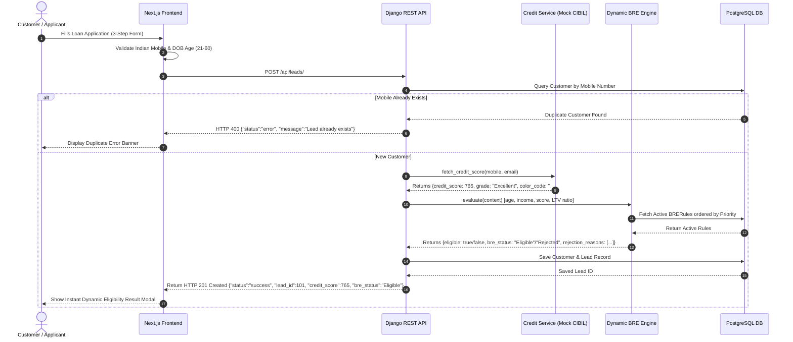

# API Flow Sequence Diagram

```mermaid
sequenceDiagram
    autonumber
    actor Customer as Customer / Applicant
    participant FE as Next.js Frontend
    participant DRF as Django REST API
    participant Bureau as Credit Service (Mock CIBIL)
    participant BRE as Dynamic BRE Engine
    participant DB as PostgreSQL DB

    Customer->>FE: Fills Loan Application (3-Step Form)
    FE->>FE: Validate Indian Mobile & DOB Age (21-60)
    FE->>DRF: POST /api/leads/
    
    DRF->>DB: Query Customer by Mobile Number
    alt Mobile Already Exists
        DB-->>DRF: Duplicate Customer Found
        DRF-->>FE: HTTP 400 {"status":"error", "message":"Lead already exists"}
        FE-->>Customer: Display Duplicate Error Banner
    else New Customer
        DRF->>Bureau: fetch_credit_score(mobile, email)
        Bureau-->>DRF: Returns {credit_score: 765, grade: "Excellent", color_code: "#22C55E"}
        
        DRF->>BRE: evaluate(context) [age, income, score, LTV ratio]
        BRE->>DB: Fetch Active BRERules ordered by Priority
        DB-->>BRE: Return Active Rules
        BRE-->>DRF: Returns {eligible: true/false, bre_status: "Eligible"/"Rejected", rejection_reasons: [...]}
        
        DRF->>DB: Save Customer & Lead Record
        DB-->>DRF: Saved Lead ID #101
        
        DRF-->>FE: Return HTTP 201 Created {"status":"success", "lead_id":101, "credit_score":765, "bre_status":"Eligible"}
        FE-->>Customer: Show Instant Dynamic Eligibility Result Modal
    end
```
