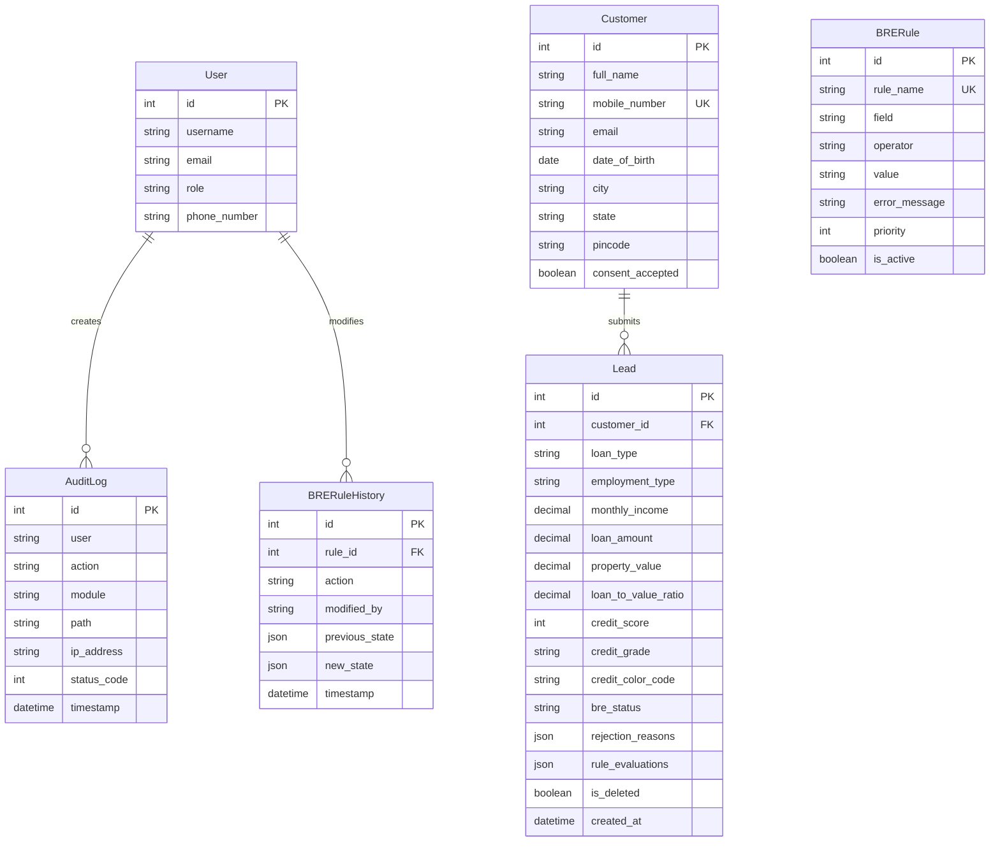

# Entity Relationship (ER) Diagram

```mermaid
erDiagram
    User ||--o{ AuditLog : creates
    User ||--o{ BRERuleHistory : modifies
    Customer ||--o{ Lead : submits
    
    User {
        int id PK
        string username
        string email
        string role
        string phone_number
    }

    Customer {
        int id PK
        string full_name
        string mobile_number UK
        string email
        date date_of_birth
        string city
        string state
        string pincode
        boolean consent_accepted
    }

    Lead {
        int id PK
        int customer_id FK
        string loan_type
        string employment_type
        decimal monthly_income
        decimal loan_amount
        decimal property_value
        decimal loan_to_value_ratio
        int credit_score
        string credit_grade
        string credit_color_code
        string bre_status
        json rejection_reasons
        json rule_evaluations
        boolean is_deleted
        datetime created_at
    }

    BRERule {
        int id PK
        string rule_name UK
        string field
        string operator
        string value
        string error_message
        int priority
        boolean is_active
    }

    BRERuleHistory {
        int id PK
        int rule_id FK
        string action
        string modified_by
        json previous_state
        json new_state
        datetime timestamp
    }

    AuditLog {
        int id PK
        string user
        string action
        string module
        string path
        string ip_address
        int status_code
        datetime timestamp
    }
```
